# PlaneFlow — UI Wireframes & Screen Flow

> The **layout** layer of the design: what every screen contains, *where* things sit,
> how big they are, and how screens connect. Parent: [`art_direction_v1.md`](art_direction_v1.md);
> behavioural rules in [`ui_rules.md`](ui_rules.md); palette in [`color_palette.md`](color_palette.md).
>
> This is the artifact people mean by **wireframe / mockup / UX layout / screen-flow** —
> the part that decides menu shape, button placement and sizing, and the overall
> on-screen composition (independent of exact colour shades).
>
> ⚠️ **These are a fresh proposal, not the current `index.html`.** They redesign the
> layout from the gameplay up. Rendered mockups + the build script live in
> [`../../assets/design/wireframes/`](../../assets/design/wireframes/) — edit `build.py`
> and re-run `python3 build.py` to regenerate every image.

---

## Design thesis (why this layout)

The whole game is **drawing routes with a finger, in landscape**. Every layout choice
serves that single act:

1. **The field is sacred.** The centre of the screen is the drawing canvas. The HUD must
   never sit where a route is drawn. → HUD collapses to **one slim top bar**; everything
   else is contextual or edge-hugging.
2. **Economy lives on the world, not in a panel.** Opening / upgrading a service box is a
   property *of that box*, so the cost/upgrade chip sits **on the box** (tap it to act).
   No separate build menu eating screen space.
3. **Information appears where you're already looking.** A tapped plane's to-do list
   **floats next to the plane**, connected by a thin leader — not parked in a far corner.
4. **Glance, don't read.** Top bar is icon-first: hearts, coin, combo, a goal bar, timer,
   pause. Numbers are big; labels are minimal (see [`ui_rules.md`](ui_rules.md)).
5. **Thumbs over reach.** Menu primary CTAs sit low/right where a landscape grip rests;
   destructive actions (Reset) are visually separated.

The visual language (rounded warm cards, soft shadow, the 6–7 colour palette) is
**unchanged** — only the composition is new.

---

## Screen flow

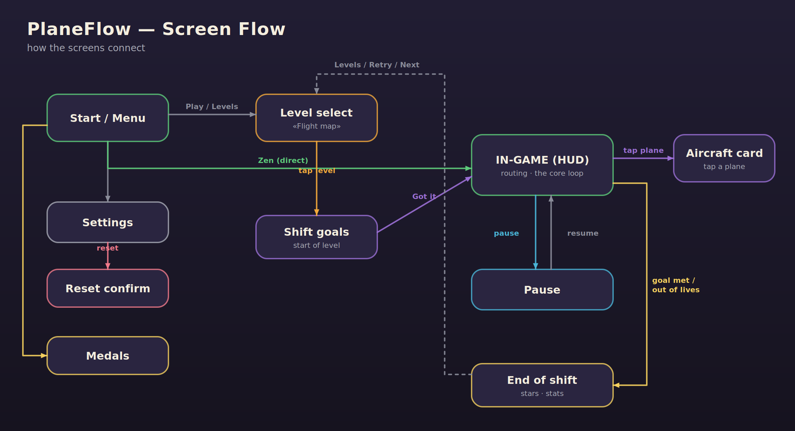

```
Start/Menu ──Play──► Level select ──tap level──► Shift goals ──Got it──► IN-GAME (HUD)
   │  │  └──Zen────────────────────────────────────────────────────────►   │   │
   │  └──► Settings ──reset──► Reset confirm                                 │   └─tap plane─► Aircraft card
   └──► Medals                                                  pause ‖ ◄──► │
                                                                     Pause   │
   Level select ◄──Levels / Retry / Next── End of shift ◄──goal met / out of lives──┘
```

---

## Screens

### 01 · Start / Main menu
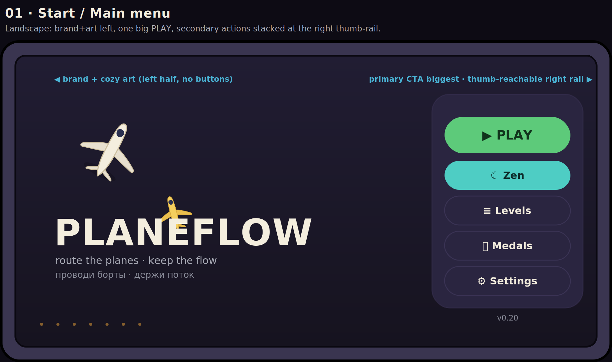

- **Left half:** wordmark + cozy top-down art (planes), no buttons — it breathes.
- **Right rail (thumb side):** one oversized **PLAY**, then a stack of secondary tiles —
  **Zen · Levels · Medals · Settings**. Version number quiet at the bottom.
- Sizes: primary CTA ≈ 200×58, secondary tiles ≈ 200×46, full-width touch targets.

### 02 · Level select — «Flight map»
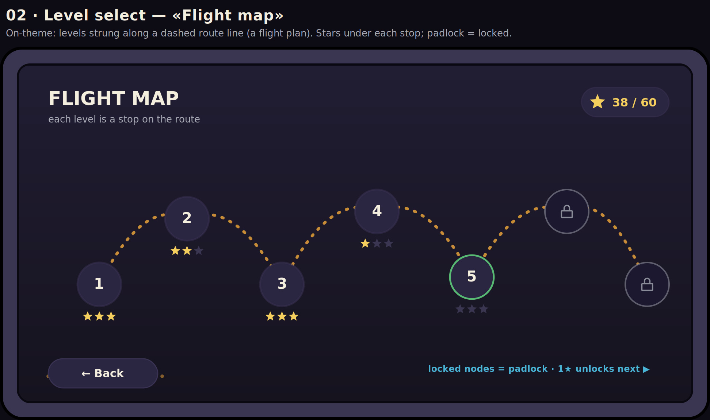

- Levels are **stops strung along a dashed flight-route line** (on-theme: this is a
  routing game). Each stop = a node with its number, three star slots below, padlock if
  locked. Current/next stop gets a green ring.
- Star total chip top-right; **Back** bottom-left. Horizontally scrollable.

### 03 · In-game HUD *(the hero screen)*
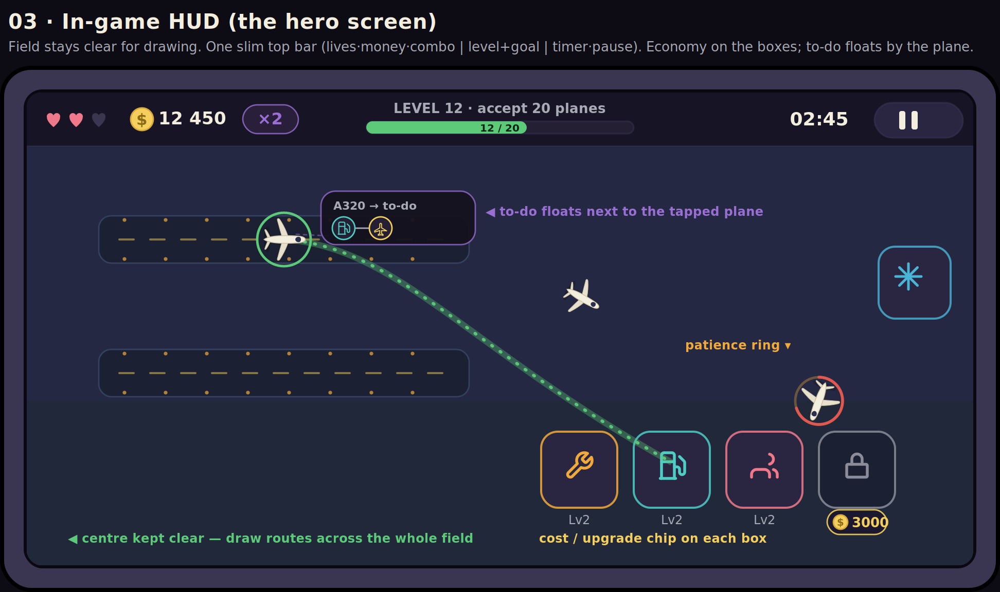

- **One slim top bar (~52px, translucent):**
  - left cluster — **lives** (hearts) · **money** (coin + amount) · **combo** (×2 badge);
  - centre — **Level + goal** label over a thin **progress bar** (`12 / 20`);
  - right — **timer** + a large **pause** button.
- **Field below stays empty** for drawing. Service boxes carry their own **cost/upgrade
  chip**. The **de-icing box** sits at the right edge (always open).
- **Selected plane** shows a green ring + its glowing route; **waiting planes** (arriving
  from the right) show the **patience ring**.
- **To-do card** floats beside the tapped plane with a thin leader line.

### 04 · Aircraft info / to-do
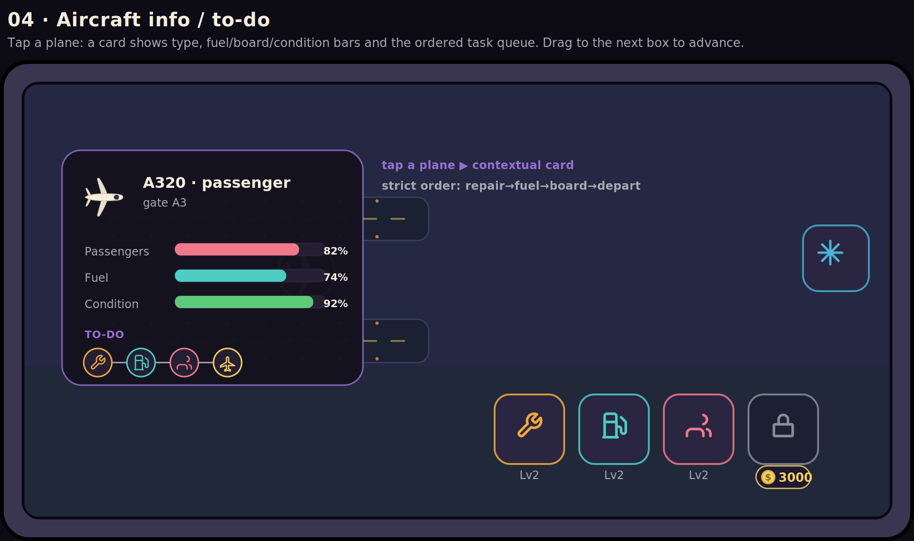

- Tap a plane → card with type/destination, **Passengers / Fuel / Condition** bars, and
  the **ordered task queue** (repair → fuel → board → depart). Drag to the next box to
  advance. Order is strict.

### 05 · Pause
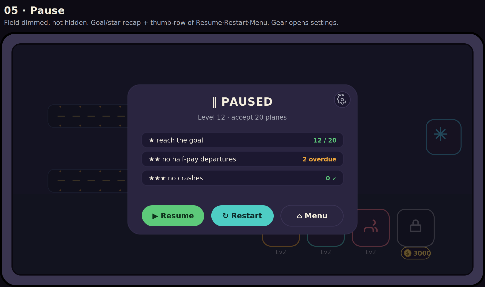

- Field is **dimmed, not hidden** (keeps context). Card shows the **goal/star recap**
  (★ goal, ★★ no overdue, ★★★ no crashes) with live values, and a **thumb-row** of
  **Resume · Restart · Menu**. Gear (top-right of card) opens Settings.

### 06 · Shift goals (start of level)
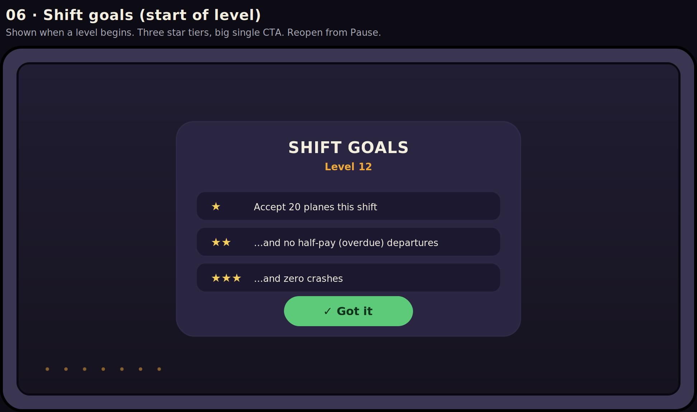

- Shown when a level begins. Three **star tiers** with one-line descriptions, one big
  **Got it** CTA. Reopenable from Pause.

### 07 · End of shift
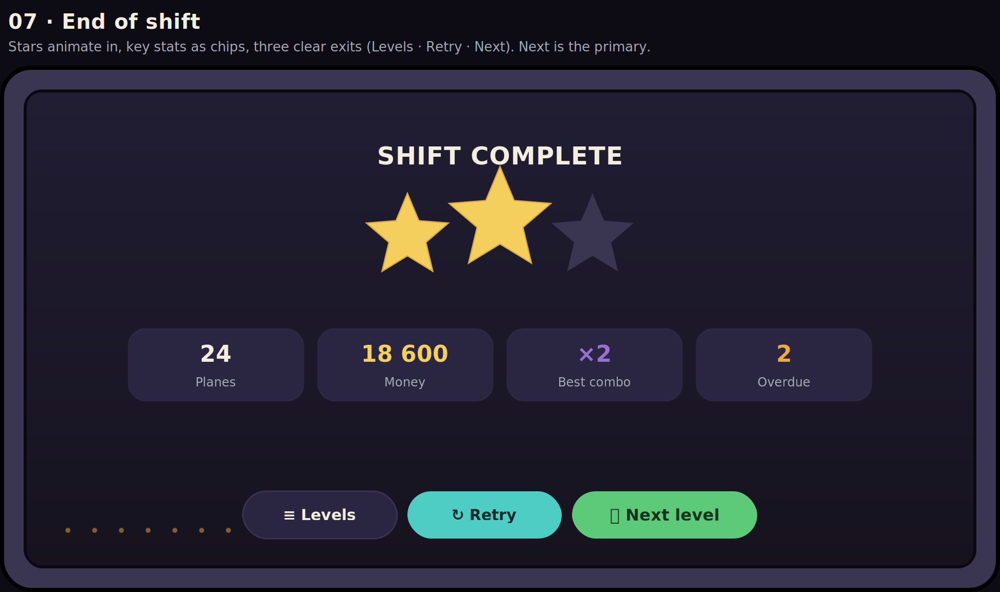

- **Stars** earned (centre, the middle one largest), then **stat chips** (Planes · Money ·
  Best combo · Overdue). Three exits: **Levels · Retry · Next** (Next is primary).

### 08 · Settings
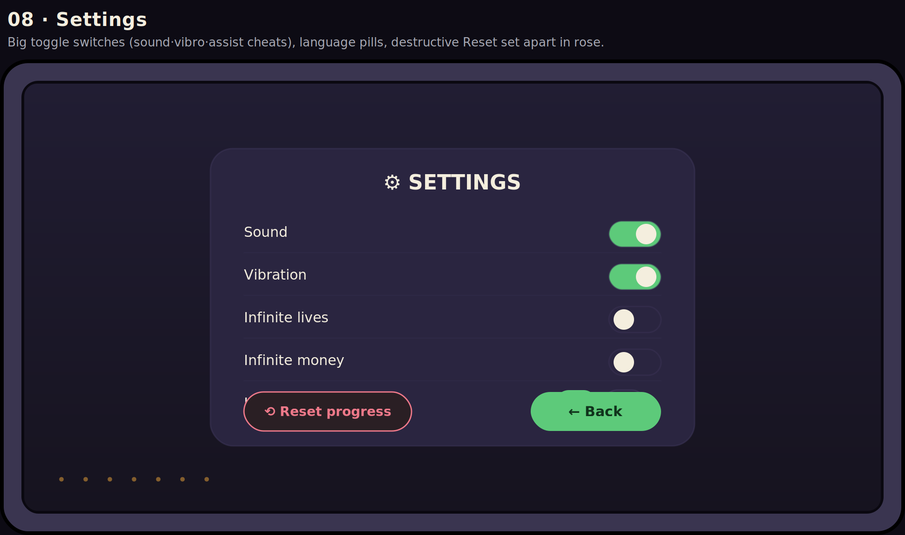

- Large **toggle switches** (Sound · Vibration · assist cheats), **language** pills, and a
  separated, rose-tinted **Reset progress** (destructive) apart from the green **Back**.

### 09 · Medals / Achievements
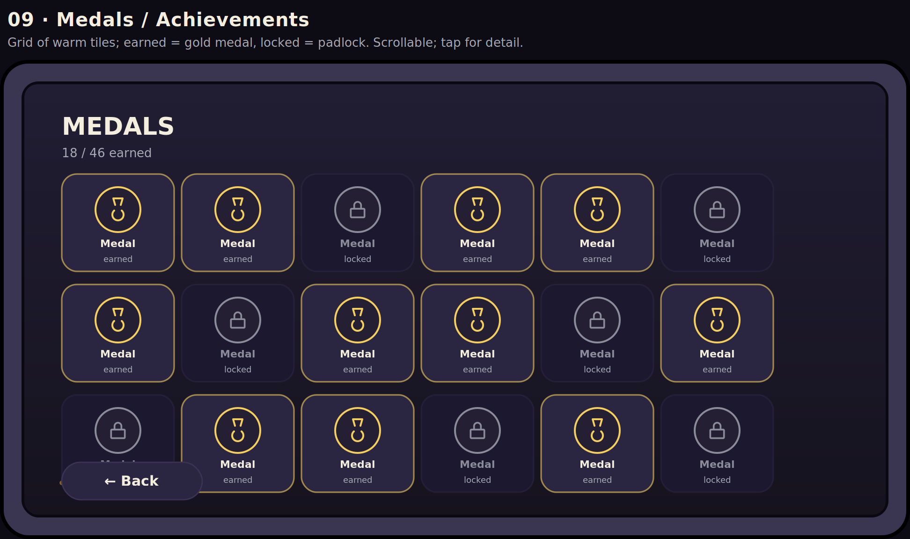

- Grid of warm tiles: **earned = gold medal**, **locked = padlock**. Count up top,
  scrollable, tap a tile for detail.

---

## Redesign variants — screens 01 (Start) & 03 (HUD)

Screens 1 and 3 are flagged for a rework. Below are directions to choose between before
implementing them; render with `python3 variants.py`.

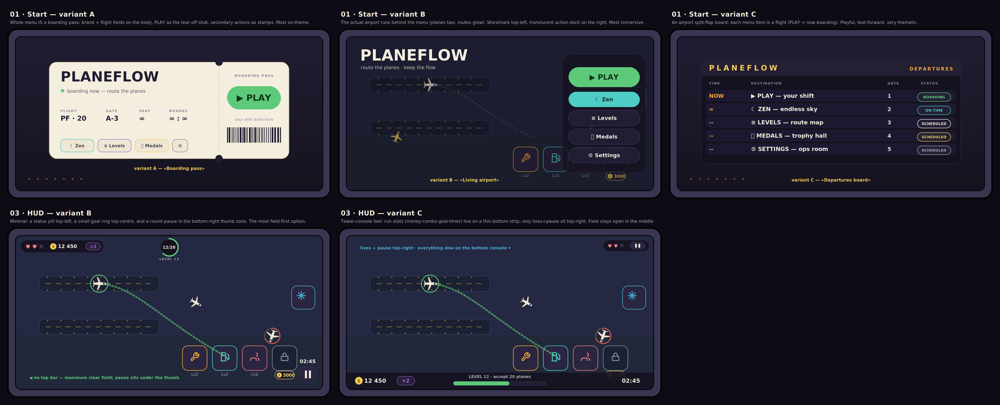

**Start (01):**
- **A · «Boarding pass»** — the whole menu *is* a boarding pass: brand + flight fields on
  the body, **PLAY as the tear-off stub**, secondary actions as stamps. Most on-theme.
- **B · «Living airport»** — the real top-down airport runs behind the menu (planes taxi,
  routes glow); wordmark top-left, a translucent action dock on the right. Most immersive.
- **C · «Departures board»** — a split-flap board where each menu item is a flight
  (PLAY = *now boarding*). Playful, text-forward.

**HUD (03):**
- **A · «Slim top bar»** — the current proposal (screen 03 above): one translucent top bar.
- **B · «Corners / minimal»** — no top bar; a status pill top-left, a small goal ring
  top-centre, a round **pause in the bottom-right thumb zone**. Most field-first.
- **C · «Tower console»** — run stats (money · combo · goal · timer) on a thin **bottom
  strip**; only lives + pause top-right.

> **Decision (locked):** Start (01) and HUD (03) keep their **original proposal**
> (`01-start` and `03-hud` «slim top bar» = HUD variant A); the other variants stay here
> as reference only. Level select (02) **keeps the shipped «luggage-cart» map** — not
> replaced.

## Implementation status (in `index.html`)

Adopting this design is happening as a **presentation-layer** change only — **gameplay,
arriving-plane positions and service-box positions are not touched** (the in-game layout
hangs off the reserved `HUD_H` top band; that band is left unchanged).

- ✅ **Shared design language** (CSS): warm sans-serif headings/body, rounded green
  primary CTA + soft secondary buttons, warm raised cards, **toggle switches** in
  Settings, warmed goal/stat cards. This restyles **Pause, Shift goals, End of shift,
  Settings, Medals** and the menu chrome toward the mockups.
- ✅ **Start (01)** — two-column layout (brand + art left, action rail right) per mockup 01.
- ✅ **HUD (03)** — top bar reworked to the «slim bar» proposal: left cluster
  (lives · money · combo badge), centre (level + goal **progress bar**), right
  (timer + pause). `HUD_H` and all field/box/plane geometry untouched.
- ⛔ **Level select (02)** — keeps the shipped **«luggage-cart» map** by decision; the
  «flight-map» mockup stays as a reference idea only.

## Layout tokens (starting targets)

| Token | Value | Note |
| --- | --- | --- |
| Top HUD bar height | ~52px | translucent, edge-to-edge |
| Primary CTA | ~200×58 | one per screen |
| Secondary button | ~200×46 / chips ~150×40 | thumb-sized |
| Service box | ~74×74, radius 16 | cost chip below |
| Card radius | 20–24 | warm rounded |
| Screen safe-edge | ~24px | from device edge |
| Aspect | landscape 2:1 mock (16:9 device) | landscape only |

> These are layout targets to confirm against implementation, mirroring the palette
> doc's convention. Adjust in `build.py` and regenerate.
